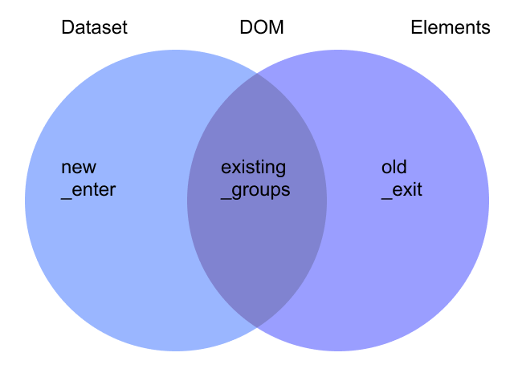

# D3 - Scatterplot Chart

Let's create another chart that's a little more complex.

There are many questions we could ask our weather dataset about the relationship between different metrics. Let's investigate these two metrics:

- dew point - the highest temperature (°F) at which dew droplets form
- humidity - the amount of water vapor in the air

We expect them to be correlated — high humidity should cause a higher dew point temperature.

Here is the [chart](https://dataviz-exercises.netlify.app/dew-point/index.html) we are going to build.

Here is the [final with interactivity](https://dataviz-exercises.netlify.app/dew-point-interactive/index.html).

## Deciding the Chart Type

When looking at the relationship between two metrics, a scatterplot is a good choice.

A scatterplot includes two axes:

- an x axis that displays one metric and
- a y axis that displays the other

We'll plot each data point (in this case, a single day) as a dot. If we wanted to involve a third metric, we could even add another dimension by changing the color or the size of each dot.

## Steps in Drawing Any Chart

Let's solidify our foundation by splitting our chart-creating code into seven general steps.

1. Access data - look at the data structure and declare how to access the values we'll need
1. Create chart dimensions - declare the physical (i.e. pixels) chart parameters
1. Draw canvas - render the chart area and bounds element
1. Create scales - create scales for every data-to-physical attribute in our chart
1. Draw data - render your data elements
1. Draw peripherals - render your axes, labels, and legends
1. Set up interactions - initialize event listeners and create interaction behavior

## Step One: Access Data

As we saw, this step will be quick! We can utilize d3.json() to grab the my_weather_data.json file.

```js
async function drawScatter() {
  let dataset = await d3.json("./data/my_weather_data.json");
}
drawScatter();
```

The next part is to create our accessor functions. Let's log the first data point to the console to look at the available keys.

```js
const dataset = await d3.json("./data/my_weather_data.json");
console.table(dataset[0]);
```

We can see the metrics we're interested in as humidity and dewPoint. Let's use those to define our accessor functions.

```js
const xAccessor = (d) => d.dewPoint;
const yAccessor = (d) => d.humidity;
console.log(data[0]);
console.log(xAccessor(data[0]));
```

Code:

```js
async function drawScatter() {
  // 1. Access data
  let dataset = await d3.json("./data/my_weather_data.json");

  const xAccessor = (d) => d.dewPoint;
  const yAccessor = (d) => d.humidity;
}
drawScatter();
```

## Step Two: Create Chart Dimensions

We'll create a square chart that fits within any browser window.

Typically, scatterplots are square, with the x axis as wide as the y axis is tall. This makes it easier to look at the overall shape of the data points once they're plotted by not stretching or squashing one of the scales.

We want the height to be the same as the width. We could use the same width we used previously (`window.innerWidth * 0.9`), but then the chart might extend down the page, out of view on horizontal screens.

Ideally, the chart will be as large as possible while still fitting on our screen.

To fix this problem, we want to use either the height or the width of the window, whichever one is smaller. And because we want to leave a little bit of whitespace around the chart, we'll multiply the value by 0.9 (90% of the total width or height).

`d3-array` can help us out here with the `d3.min` method. `d3.min` takes two arguments:

1. an array of data points
1. an accessor function to grab the value from each data point

In this case we won't need to specify the second parameter because it defaults to an identity function and returns the value.

```js
const width = d3.min([window.innerWidth * 0.9, window.innerHeight * 0.9]);
```

> There is a native browser method (`Math.min`) that will also find the lowest number. There are a few benefits to `d3.min`:

```js
const width = d3.min([window.innerWidth * 0.9, window.innerHeight * 0.9]);
const arr = [6, 1, 2, 3, undefined];
console.log({
  d3: d3.min(arr),
  Math: Math.min(...arr),
});
```

- `Math.min` will count any nulls in the array as 0, whereas d3.min will ignore them
- `Math.min` will return NaN if there is a value in the array that is undefined or can't be converted into a number, whereas d3.min will ignore it
- `d3.min` will prevent the need to create another array of values if we need to use an accessor function
- `Math.min` will return Infinity if the dataset is empty, whereas d3.min will return undefined
- `Math.min` uses numeric order, whereas d3.min uses natural order, which allows it to handle strings. Make sure to convert your values to numbers beforehand

D3.min also allows an accessor function:

```js
const width = d3.min([window.innerWidth * 0.9, window.innerHeight * 0.9]);
const arr = [1, 2, 3];
console.log({
  d3: d3.min(arr, (d) => d * 2),
  Math: Math.min(...arr),
});
```

So we could get the smallest x value from our dataset:

```js
console.log({
  d3: d3.min(dataset, xAccessor),
  Math: Math.min(...arr),
});
```

You can see how `d3.min` would be preferable when creating charts, especially when using dynamic data.

Use the width variable to define the chart dimensions:

```js
let dimensions = {
  width: width,
  height: width,
};
```

We want a small top and right margin to give the chart some space. Dots near the top or right of the chart or the y axis's topmost tick label might overflow our bounds (because the position of the dot is technically the center of the dot, but the dot has a radius).

We'll want a larger bottom and left margin to create room for our axes.

```js
let dimensions = {
  width: width,
  height: width,
  margin: {
    top: 10,
    right: 10,
    bottom: 50,
    left: 50,
  },
};
```

Lastly, we want to define the width and height of our bounds, calculated from the space remaining after we add the margins.

```js
dimensions.boundedWidth =
  dimensions.width - dimensions.margin.left - dimensions.margin.right;
dimensions.boundedHeight =
  dimensions.height - dimensions.margin.top - dimensions.margin.bottom;

window.dimensions = dimensions;
```

Code:

```js
async function drawScatter() {
  // 1. Access data
  let dataset = await d3.json("./data/my_weather_data.json");

  const xAccessor = (d) => d.dewPoint;
  const yAccessor = (d) => d.humidity;

  // 2. Create chart dimensions

  const width = d3.min([window.innerWidth * 0.9, window.innerHeight * 0.9]);
  let dimensions = {
    width: width,
    height: width,
    margin: {
      top: 10,
      right: 10,
      bottom: 50,
      left: 50,
    },
  };
  dimensions.boundedWidth =
    dimensions.width - dimensions.margin.left - dimensions.margin.right;
  dimensions.boundedHeight =
    dimensions.height - dimensions.margin.top - dimensions.margin.bottom;
}

drawScatter();
```

## Step Three: Draw Canvas

This step will look exactly like our line chart code. First, we find an existing DOM element (`#wrapper`), and append an `<svg>` element.

Then we use `attr` to set the size of the `<svg>` to our `dimensions.width` and `dimensions.height`. Recall that these sizes are the size of the "outside" of our plot.

```js
const wrapper = d3
  .select("#wrapper")
  .append("svg")
  .attr("width", dimensions.width)
  .attr("height", dimensions.height);
```

Create our bounds and shift them to accommodate our top & left margins:

```js
const bounds = wrapper
  .append("g")
  .style(
    "transform",
    `translate(${dimensions.margin.left}px, ${dimensions.margin.top}px)`
  );
```

Above we create a group element and use the transform CSS property to move it to the right and down (note that the left margin pushes our bounds to the right, and a top margin pushes our bounds down).

This is the "inner" part of our chart that we will use for our data elements.

## Step Four: Create Scales

Before we draw our data, we have to figure out how to convert numbers from the data domain to the pixel domain.

Let's start with the x axis. We want to determine the horizontal position of each day's dot based on its dew point.

To find this position we use a d3 scale object, which helps us map our data to pixels. Let's create a scale that will take a dew point and tell us how far to the right a dot needs to be.

This will be a linear scale because the input (dew point) and the output (pixels) will be numbers that increase linearly.

`const xScale = d3.scaleLinear()`

### The concept behind scales

Recall, we need to tell our scale:

- what inputs it will need to handle (domain), and
- what outputs we want back (range).

Pretend that the temperatures in our dataset range from 0 to 100 degrees.

In this case, converting from temperature to pixels is easy: a temperature of 50 degrees maps to 50 pixels because both range and domain are [0,100].

But the relationship between our data and the pixel output is rarely so simple. What if our chart was 200 pixels wide? What if we have to handle negative temperatures?

Mapping between metric values and pixels is one of the areas in which d3 shines.

### Finding the extents

In order to create a scale, we need to pick the smallest and largest values we will handle. These numbers can be anything you want, but the standard practice is to examine your data and extract the minimum and maximum values. This way your chart will "automatically" scale according to the values in your dataset.

D3 has a helper function we can use here: `d3.extent()` that takes two parameters:

- an array
- an accessor function that extracts the metric value from a data point. If not specified, this defaults to an identity function `d => d`.

We'll pass `d3.extent()` our dataset and our `xAccessor()` function and get the min and max temperatures we need to handle (in `[min, max]` format).

```js
const xScale = d3.scaleLinear().domain(d3.extent(dataset, xAccessor));
console.log(xScale.domain());
```

```js
const xScale = d3
  .scaleLinear()
  .domain(d3.extent(dataset, xAccessor))
  .range([0, dimensions.boundedWidth]);
```

This scale will create a perfectly useable chart, but we can make it slightly friendlier. With this x scale, our x axis will have a domain of `[11.8, 77.26]` — the exact min and max values from the dataset. The resulting chart will have dots that extend all the way to the left and right edges.

While this works, it would be easier to read the axes if the first and last tick marks were round values. Note that d3 won't even label the top and bottom tick marks of an axis with a strange domain — it might be hard to reason about a chart that scales up to 77.26 degrees. That number of decimal points gives too much unnecessary information to the reader, making them do the next step of rounding the number to a more tangible one.

d3 scales have a `.nice()` method that will round our scale's domain, giving our x axis friendlier bounds.

We can look at how `.nice()` modifies our x scale's domain by looking at the values before and after using `.nice()`. Note that calling `.domain()` without parameters on an existing scale will output the scale's existing domain instead of updating it.

```js
console.log(xScale.domain());
xScale.nice();
console.log(xScale.domain());
```

With the New York City dataset, the domain changes from `[11.8, 77.26]` to `[10, 80]`. Let's chain that method when we create our scale.

```js
const xScale = d3
  .scaleLinear()
  .domain(d3.extent(dataset, xAccessor))
  .range([0, dimensions.boundedWidth])
  .nice();
```

Creating our y scale will be very similar to creating our x scale. The only differences are:

1. we'll be using our `yAccessor()` to grab the humidity values, and
1. we want to invert the range to make sure the axis runs bottom-to-top

```js
const yScale = d3
  .scaleLinear()
  .domain(d3.extent(dataset, yAccessor))
  .range([dimensions.boundedHeight, 0])
  .nice();
```

Note that we invert the values for the range since we want our chart to go from bottom to top (while svg measures from top to bottom).

If you're curious about how `.nice()` modifies our y scale, log these values:

```js
console.log(d3.extent(dataset, yAccessor));
console.log(yScale.domain());
```

In this case, the domain changed from `[0.27, 0.97]` to `[0.2, 1]`, which will create a much friendlier chart.

Code so far:

```js
async function drawScatter() {
  // 1. Access data
  let dataset = await d3.json("./data/my_weather_data.json");

  const xAccessor = (d) => d.dewPoint;
  const yAccessor = (d) => d.humidity;

  // 2. Create chart dimensions

  const width = d3.min([window.innerWidth * 0.9, window.innerHeight * 0.9]);
  let dimensions = {
    width: width,
    height: width,
    margin: {
      top: 10,
      right: 10,
      bottom: 50,
      left: 50,
    },
  };
  dimensions.boundedWidth =
    dimensions.width - dimensions.margin.left - dimensions.margin.right;
  dimensions.boundedHeight =
    dimensions.height - dimensions.margin.top - dimensions.margin.bottom;

  // 3. Draw canvas

  const wrapper = d3
    .select("#wrapper")
    .append("svg")
    .attr("width", dimensions.width)
    .attr("height", dimensions.height);

  const bounds = wrapper
    .append("g")
    .style(
      "transform",
      `translate(${dimensions.margin.left}px, ${dimensions.margin.top}px)`
    );

  // 4. Create scales

  const xScale = d3
    .scaleLinear()
    .domain(d3.extent(dataset, xAccessor))
    .range([0, dimensions.boundedWidth])
    .nice();

  const yScale = d3
    .scaleLinear()
    .domain(d3.extent(dataset, yAccessor))
    .range([dimensions.boundedHeight, 0])
    .nice();
}
drawScatter();
```

## Step Five: Draw Data

We'll discuss data joins - one of the trickiest parts of d3, and necessary for updating our charts & binding our visualization to data.

Drawing our scatter plot dots will be different from how we drew our timeline. Instead of one line covering all the data points we want one element per data point.

We'll use the `<circle>` SVG element with `cx` and `cy` attributes which set its x and y coordinates. These position the center of the circle, and the `r` attribute sets the circle's radius (half of its width or height).

Let's draw a circle in the center of our chart using our dimensions:

```js
bounds
  .append("circle")
  .attr("cx", dimensions.boundedWidth / 2)
  .attr("cy", dimensions.boundedHeight / 2)
  .attr("r", 5);
```

Now let's add one circle for each day.

One way of drawing the dots would be to map over each element in the dataset and append a circle to our bounds.

We grab the values for `cx` and `cy` from our data using our scales and passing in our accessors:

```js
dataset.forEach((d) => {
  bounds
    .append("circle")
    .attr("cx", xScale(xAccessor(d)))
    .attr("cy", yScale(yAccessor(d)))
    .attr("r", 5);
});
```

While this method of drawing the dots works, we're adding a level of nesting which makes our code harder to read.

If we run this function twice, we'll end up drawing two sets of dots on top of each other.

When we start updating our charts, we will want to draw and update our data with the same code to prevent repeating ourselves.

D3 has functions that will help us address these issues and keep our code clean. Let's handle the dots in the d3 way - without using a loop.

### Data joins

Delete the last `forEach` block of code.

We'll start off by grabbing all `<circle>` elements in a d3 selection object. Instead of using d3.selection's `.select()` method, which returns one matching element, we'll use its `.selectAll()` method, which returns an array of matching elements.

`const dots = bounds.selectAll("circle")`

This will seem strange at first — we don't have any dots yet, why would we select something that doesn't exist? Don't worry. You'll soon become comfortable with this pattern.

By using `const dots = bounds.selectAll("circle")` we're creating a d3 selection that is _aware of what elements already exist_. If we had already drawn part of our dataset, this selection would be aware of what dots were already drawn, and which need to be added.

```js
const dots = bounds.selectAll("circle");
console.log(dots);
```

This returns an empty array for `_groups`.

To tell the selection what our data look like, we'll pass our dataset to the selection's `.data()` method.

```js
const dots = bounds.selectAll("circle").data(dataset);
console.log(dots);
```

Once we pass the data in we log new items in the `select`: `enter` and `exit`.

When we call `.data()` on our selection, we're joining our selected elements with our array of data points.

The returned selection will have:

1. a list of existing elements
1. new elements that need to be added
1. old elements that need to be removed

We'll see these changes to our selection object in three ways:

- our selection object is updated to contain any overlap between existing DOM elements and data points
- an `_enter` key is added that lists any data points that don't already have an element rendered (365 here)
- an `_exit` key is added that lists any data points that are already rendered but aren't in the provided dataset (0 here)



Let's get an idea of what that updated selection object looks like by logging it to the console.

```js
let dots = bounds.selectAll("circle");
console.log(dots);
dots = dots.data(dataset);
console.log(dots);
```

Recall that the currently selected DOM elements are located under the `_groups` key. Before we join our dataset to our selection, the selection just contains an empty array. That makes sense - there are no circles in bounds yet.

(View the results of the first `console.log(dots)`.)

However, the next selection object looks different. We have two new keys: `_enter` and `_exit`, and our `_groups` array has an array with 365 elements — the number of data points in our dataset.

(View the results of the second `console.log(dots);`.)

Take a closer look at the `_enter` key. If we expand the array and look at one of the values, we can see an object with a `__data__` property.

> The namespaceURI key tells the browser that the element is a SVG element and needs to be created in the "http://www.w3.org/2000/svg" namespace (SVG).

If we expand the `__data__` value, we will see one of our data points.

We can see that each value in `_enter` corresponds to a value in our dataset. This is what we would expect, since all of the data points need to be added to the DOM.

The `_exit` value is an empty array — if we were removing existing elements, we would see those listed here.

In order to act on the new elements we can create a d3 selection object containing just those elements with the `enter` method. There is a matching method (exit) for old elements that we'll need when we look at transitions between data sets.

```js
const dots = bounds.selectAll("circle").data(dataset).enter();
console.log(dots);
```

This looks just like any d3 selection object we've manipulated before. Let's append one `<circle>` for each data point. We can use the same `.append()` method we've been using for single-node selection objects and d3 will create one element for each data point.

```js
const dots = bounds.selectAll("circle").data(dataset).enter().append("circle");
```

When we load our webpage we still have a blank page. However, we will be able to see 365 new empty `<circle>` elements in our bounds in the browser's Elements panel.

Set the position and size of the new entering circles using `.enter()`

```js
const dots = bounds.selectAll("circle").data(dataset).enter();
console.log(dots);
```

```js
const dots = bounds
  .selectAll("circle")
  .data(dataset)
  .enter()
  .append("circle")
  .attr("cx", (d) => xScale(xAccessor(d)))
  .attr("cy", (d) => yScale(yAccessor(d)))
  .attr("r", 5);
```

We can write the same code we would write for a single-node selection object. Any attribute values that are functions will be passed each data point individually. This helps keep our code concise and consistent.

Make these dots a lighter color to help them stand out:

`.attr("fill", "cornflowerblue")`

### Visualizing data joins

Here's a quick example to help visualize the data join concept. We're going to split the dataset in two and draw both parts separately. Temporarily edit out your finished dots code so we have a clear slate to work with. We'll revert back to it when we're done with this mini exercise.

Let's add a function called `drawDots()` that mimics our dot drawing code. This function will select all existing circles, join them with a provided dataset, and draw any new circles with a provided color.

```js
  // 5. Draw data
  const drawDots = (dataset, color) => {
    const dots = bounds
      .selectAll("circle")
      .data(dataset)
      .enter()
      .append("circle")
      .attr("cx", (d) => xScale(xAccessor(d)))
      .attr("cy", (d) => yScale(yAccessor(d)))
      .attr("r", 5)
      .attr("fill", color);
  };
  drawDots(dataset.slice(0, 100), "gray");
}
drawScatter();
```

Then, add some logging and another slice after one second:

```js
  // 5. Draw data
  const drawDots = (dataset, color) => {
    const dots = bounds.selectAll("circle").data(dataset);

    console.log(dots);

    dots
      .enter()
      .append("circle")
      .attr("cx", (d) => xScale(xAccessor(d)))
      .attr("cy", (d) => yScale(yAccessor(d)))
      .attr("r", 5)
      .attr("fill", color);
  };
  drawDots(dataset.slice(0, 100), "gray");
  setTimeout(() => {
    drawDots(dataset, "cornflowerblue");
  }, 1000);
}
drawScatter();
```

In the log we can see the exit array (the old or previously created dots) has a length of 100. These dots were not recreated.

Clean up the code to reset it back to:

```js
const dots = bounds
  .selectAll("circle")
  .data(dataset)
  .enter()
  .append("circle")
  .attr("cx", (d) => xScale(xAccessor(d)))
  .attr("cy", (d) => yScale(yAccessor(d)))
  .attr("r", 5)
  .attr("fill", "cornflowerblue");
```

> So many people found `.enter()` etc. to be confusing that d3's maintainers added `.join()` as an easier alternative. However, it is good to start building an understanding of `._enter()` etc. in order to understand what's going on under the hood.

```js
  // 5. Draw data
  const dots = bounds.selectAll("circle").data(dataset);

  dots
    // NEW
    .join("circle")
    .attr("cx", (d) => xScale(xAccessor(d)))
    .attr("cy", (d) => yScale(yAccessor(d)))
    .attr("r", 5)
    .attr("fill", "cornflowerblue");
}
drawScatter();
```

Code so far:

```js
async function drawScatter() {
  // 1. Access data
  let dataset = await d3.json("./data/my_weather_data.json");

  const xAccessor = (d) => d.dewPoint;
  const yAccessor = (d) => d.humidity;

  // 2. Create chart dimensions

  const width = d3.min([window.innerWidth * 0.9, window.innerHeight * 0.9]);
  let dimensions = {
    width: width,
    height: width,
    margin: {
      top: 10,
      right: 10,
      bottom: 50,
      left: 50,
    },
  };
  dimensions.boundedWidth =
    dimensions.width - dimensions.margin.left - dimensions.margin.right;
  dimensions.boundedHeight =
    dimensions.height - dimensions.margin.top - dimensions.margin.bottom;

  // 3. Draw canvas

  const wrapper = d3
    .select("#wrapper")
    .append("svg")
    .attr("width", dimensions.width)
    .attr("height", dimensions.height);

  const bounds = wrapper
    .append("g")
    .style(
      "transform",
      `translate(${dimensions.margin.left}px, ${dimensions.margin.top}px)`
    );

  // 4. Create scales

  const xScale = d3
    .scaleLinear()
    .domain(d3.extent(dataset, xAccessor))
    .range([0, dimensions.boundedWidth])
    .nice();

  const yScale = d3
    .scaleLinear()
    .domain(d3.extent(dataset, yAccessor))
    .range([dimensions.boundedHeight, 0])
    .nice();

  // 5. Draw data
  const dots = bounds.selectAll("circle").data(dataset);

  dots
    .join("circle")
    .attr("cx", (d) => xScale(xAccessor(d)))
    .attr("cy", (d) => yScale(yAccessor(d)))
    .attr("r", 5)
    .attr("fill", "cornflowerblue");
}
drawScatter();
```

## Step Six: Draw Peripherals

Let's draw our axes, review the text SVG element and how to add (and rotate) labels - starting with the x axis.

We want our x axis to be a line across the bottom with spaced "tick" marks that have

- labels for values per tick
- a label for the axis overall

To do this, we'll create our axis generator using `d3.axisBottom()` and pass it:

- our x scale so it knows what ticks to make (from the domain)
- what size to be (from the range)

```js
const xAxisGenerator = d3.axisBottom().scale(xScale);
```

Next, we'll use our `xAxisGenerator()` and call it on a new `g` element. Remember, we need to translate the x axis to move it to the bottom of the chart bounds.

```js
const xAxis = bounds
  .append("g")
  .call(xAxisGenerator)
  .style("transform", `translateY(${dimensions.boundedHeight}px)`);
```

Let's create labels for our axis. We need a `<text>` element, which can be positioned with an x and y attribute. We'll want to position it horizontally centered and slightly above the bottom of the chart.

`<text>` elements will display their children as text — we can set that with our selection's `.html()` method.

```js
const xAxisLabel = xAxis
  .append("text")
  .attr("x", dimensions.boundedWidth / 2)
  .attr("y", dimensions.margin.bottom - 10)
  .attr("fill", "black")
  .style("font-size", "1.4em")
  .html("Dew point (°F)");
```

> We need to explicitly set the text fill to black because it inherits the `fill` value of `none` that d3 sets on the axis `<g>` element.

Let's do the same thing with the y axis. First, we need an axis generator.

D3 axes can be customized in many ways. An easy way to cut down on visual clutter is to tell our axis to aim for a certain number with the `ticks` method. Let's aim for 4 ticks, which should give the viewer enough information.

```js
const yAxisGenerator = d3.axisLeft().scale(yScale).ticks(4);
```

> Note that the resulting axis won't necessarily have exactly 4 ticks. D3 will take the number as a _suggestion_ and aim for that many ticks, but also trying to use friendly intervals.

> There are many ways to configure the ticks for a d3 axis — find them all in the [docs](https://github.com/d3/d3-axis#axis_ticks). For example, you can specify their exact values by passing an array of values to `.tickValues()`.

Use our generator to draw our y axis:

```js
const yAxis = bounds.append("g").call(yAxisGenerator);
```

To finish up, let's draw the y axis label in the middle of the y axis, just inside the left side of the chart wrapper. d3 selection objects have a `.text()` method that operates similarly to `.html()`:

```js
const yAxisLabel = yAxis
  .append("text")
  .attr("x", -dimensions.boundedHeight / 2)
  .attr("y", -dimensions.margin.left + 10)
  .attr("fill", "black")
  .style("font-size", "1.4em")
  .text("Relative humidity");
```

We'll need to rotate this label to fit next to the y axis. To rotate it around its center, we set its CSS property text-anchor to middle:

```js
const yAxisLabel = yAxis
  .append("text")
  .attr("x", -dimensions.boundedHeight / 2)
  .attr("y", -dimensions.margin.left + 10)
  .attr("fill", "black")
  .style("font-size", "1.4em")
  .text("Relative humidity")
  .style("transform", "rotate(-90deg)")
  .style("text-anchor", "middle");
}
```

## Adding Color

In our dataset, each datapoint records the cloud cover for that day.

`console.table(dataset[0])`

Let's bring in the amount of cloud cover for each day to see if there's a correlation with the other metrics. We'll show how the amount of cloud cover varies based on humidity and dew point by adding a color scale.

Looking at a value in our dataset, we can see that the amount of cloud cover exists at the key `cloudCover`. Let's add another data accessor function near the top of our file:

`const colorAccessor = d => d.cloudCover`

Create another scale after our scales.

So far, we've only looked at linear scales that convert numbers to other numbers. Scales can also convert a number into a color — we just need to replace the domain with a range of colors.

Let's make low cloud cover days be light blue and very cloudy days dark blue - that's a good semantic mapping.

```js
const colorScale = d3
  .scaleLinear()
  .domain(d3.extent(dataset, colorAccessor))
  .range(["skyblue", "darkslategrey"]);
```

If we log `colorScale(0.1)` to the console, we should see a color value, such as `rgb(126, 193, 219)`.

Update how we set the fill of each dot. Here's where we're doing that now:

`.attr("fill", "cornflowerblue")`

Instead of making every dot blue, let's use our `colorAccessor()` to grab the precipitation value, then pass that into our `colorScale()`:

`.attr("fill", d => colorScale(colorAccessor(d)))`

Refresh to see our finished scatter plot with dots of various blues.

> For a complete, accessible chart, it would be a good idea to add a legend to explain what our colors mean. We'll return to this later.

## Tooltip

Let's add tooltips to our scatter plot. We want a tooltip to give us more information when we hover over a point in our chart.

Here is the [final with tooltips](https://dataviz-exercises.netlify.app/dew-point-interactive/index.html).

Note that the HTML for the tooltip is placed inside the wrapper:

```html
<div id="wrapper" class="wrapper">
  <div id="tooltip" class="tooltip">
    <div class="tooltip-date">
      <span id="date"></span>
    </div>
    <div class="tooltip-humidity">Humidity: <span id="humidity"></span></div>
    <div class="tooltip-dew-point">Dew Point: <span id="dew-point"></span></div>
  </div>
</div>
```

We have the following CSS to define its look (note the `position: relative` on the wrapper and the `opacity` setting on the tooltip itself):

```css
.wrapper {
  position: relative;
}

.x-axis-label {
  fill: black;
  font-size: 1.4em;
  text-transform: capitalize;
}

.y-axis-label {
  fill: black;
  font-size: 1.4em;
  text-anchor: middle;
  transform: rotate(-90deg);
}

circle {
  fill: cornflowerblue;
}

body {
  display: flex;
  justify-content: center;
  padding: 3em 1em;
  font-family: sans-serif;
}

.tooltip {
  /* opacity: 0; */
  position: absolute;
  top: -14px;
  left: 0;
  padding: 0.6em 1em;
  background: #fff;
  text-align: center;
  line-height: 1.4em;
  font-size: 0.9em;
  border: 1px solid #ddd;
  z-index: 10;
  transition: all 0.1s ease-out;
  pointer-events: none;
}

.tooltip:before {
  content: "";
  position: absolute;
  bottom: 0;
  left: 50%;
  width: 12px;
  height: 12px;
  background: white;
  border: 1px solid #ddd;
  border-top-color: transparent;
  border-left-color: transparent;
  transform: translate(-50%, 50%) rotate(45deg);
  transform-origin: center center;
  z-index: 10;
}

.tooltip-date {
  margin-bottom: 0.2em;
  font-weight: 600;
  font-size: 1.1em;
  line-height: 1.4em;
}
```

At the bottom of the JS file, we'll select all of our <circle/> elements and add a mousenter and a mouseleave event.

```js
bounds
  .selectAll("circle")
  .on("mouseenter", onMouseEnter)
  .on("mouseleave", onMouseLeave);
```

We know that we'll need to modify our `#tooltip` element, so let's assign that to a variable. Let's also define our onMouseEnter() and onMouseLeave() functions.

```js
const tooltip = d3.select("#tooltip");
function onMouseEnter(event, d) {}
function onMouseLeave() {}
```

Let's first fill out our `onMouseEnter()` function. We want to display two values:

- the metric on our x axis (dew point)
- the metric on our y axis (humidity)

  For both metrics, we'll want to define a string formatter using `d3.format()`. Then we'll use that formatter to set the text value of the relevant `<span/>` in our tooltip.

```js
function onMouseEnter(event, d) {
  const formatHumidity = d3.format(".2f");
  tooltip.select("#humidity").text(formatHumidity(yAccessor(d)));

  const formatDewPoint = d3.format(".2f");
  tooltip.select("#dew-point").text(formatDewPoint(xAccessor(d)));
}
```

Let's add an extra bit of information at the bottom of this function — users will probably want to know the date of the hovered point. Our data point's date is formatted as a string, but not in a very human-readable format (for example, "2019-01-01"). Let's use `d3.timeParse` to turn that string into a date that we can re-format.

```js
const dateParser = d3.timeParse("%Y-%m-%d");
console.log(dateParser(d.date));
```

Now we need to turn our date object into a friendlier string. The d3-time-format module can help us out. `d3.timeFormat()` will take a date formatter string and return a formatter function.

The date formatter string uses the same syntax as d3.timeParse — it follows four rules:

1. it will return the string verbatim, other than specific directives,
1. these directives contain a percent sign and a letter,
1. usually the letter in a directive has two formats: lowercase (abbreviated) and uppercase (full), and
1. a dash (-) between the percent sign and the letter prevents padding of numbers.

For example, `d3.timeFormat("%Y")(new Date())` will return the current year.

A few handy directives:

- %Y: the full year
- %y: the last two digits of the year
- %m: the padded month (eg. "01")
- %-m: the non-padded month (eg. "1")
- %B: the full month name
- %b: the abbreviated month name
- %A: the full weekday name
- %a: the abbreviated weekday name
- %d: the day of the month

See the full list of directives at https://github.com/d3/d3-time-format.

Create a formatter string that prints out a friendly date.

```js
const dateParser = d3.timeParse("%Y-%m-%d");
const formatDate = d3.timeFormat("%B %A %-d, %Y");
console.log(formatDate(dateParser(d.date)));
```

Feed that in to our tooltip:

```js
const dateParser = d3.timeParse("%Y-%m-%d");
const formatDate = d3.timeFormat("%B %A %-d, %Y");
tooltip.select("#date").text(formatDate(dateParser(d.date)));
```

Next, we'll grab the x and y value of our dot , offset by the top and left margins:

```js
const x = xScale(xAccessor(d)) + dimensions.margin.left;
const y = yScale(yAccessor(d)) + dimensions.margin.top;
```

We'll use CSS's `calc()` to add these values to the percentage offsets needed to shift the tooltip. This is necessary so that we're positioning its arrow, not the top left corner.

```js
tooltip.style(
  "transform",
  `translate( calc( -50% + ${x}px), calc(-100% + ${y}px) )`
);
```

<!--
tooltip.style(
  "transform",
  `translate( calc( -50% + ${x}px), calc(-100% + ${y}px))`
);
-->

The dots are hard to hover over, though. The small hover target makes us focus really hard to move our mouse exactly over a point. To make things worse, our tooltip disappears when moving between points, making the whole interaction a little jerky.

## Voronoi

Let's talk briefly about [voronoi diagrams](https://en.wikipedia.org/wiki/Voronoi_diagram). For every location on our scatter plot, there is a dot that is the closest. A voronoi diagram partitions a plane into regions based on the closest point. Any location within each of these parts agrees on the closest point.

Voronoi are useful in many fields — from creating art to detecting neuromuscular diseases to developing predictive models for forest fires.

There is a voronoi generator built into the main d3 bundle: `d3-delaunay`.

Let's add some code at the end of the Draw data step, right before the Draw peripherals step. Instead of creating a voronoi generator, we'll create a new Delaunay triangulation. A [delaunay triangulation](https://en.wikipedia.org/wiki/Delaunay_triangulation) is a way to join a set of points to create a triangular mesh. To create this, we can pass `d3.Delaunay.from()` three parameters:

1. our dataset,
1. an x accessor function, and
1. a y accessor function.

```js
const delaunay = d3.Delaunay.from(
  dataset,
  (d) => xScale(xAccessor(d)),
  (d) => yScale(yAccessor(d))
);
```

Now we want to turn our delaunay triangulation into a voronoi diagram - our triangulation has a `.voronoi()` method.

`const voronoi = delaunay.voronoi()`

Let's bind our data and add a `<path>` for each of our data points with a class of "voronoi" (for styling with our CSS).

```js
bounds
  .selectAll(".voronoi")
  .data(dataset)
  .join("path")
  .attr("class", "voronoi");
```

We can create each path's d attribute string by passing voronoi.renderCell() the index of our data point.

```js
bounds
  .selectAll(".voronoi")
  // ...
  .attr("d", (d, i) => voronoi.renderCell(i));
```

Give our paths a stroke value of salmon so that we can look at them.

`.attr("stroke", "salmon")`

`.attr("fill", "transparent")`

Our voronoi diagram is wider and shorter than our chart. This is because it has no concept of the size of our bounds, and is using the default size of 960 pixels wide and 500 pixels tall.

Specify the size of our diagram by setting our voronoi's `.xmax` and `.ymax` values (before we draw our `<path>`s).

```js
const voronoi = delaunay.voronoi();
voronoi.xmax = dimensions.boundedWidth;
voronoi.ymax = dimensions.boundedHeight;
```

We want to capture hover events for our paths instead of an individual dot. This will be much easier to interact with because of the contiguous, large hover targets.

> Note that the mouse events on our dots won't be triggered anymore, since they're covered by our voronoi paths.

Remove the last line where we set the stroke (.attr("stroke", "salmon")) so our voronoi cells are invisible. Next, we'll update our interactions, starting by moving our mouseenter and mouseleave events from the dots to our voronoi paths.

```js
bounds
  .selectAll(".voronoi")
  // ...
  .on("mouseenter", onMouseEnter)
  .on("mouseleave", onMouseLeave);
```

Notice how much easier it is to target a specific dot.

## Changing the hovered dot's color

Now that we don't need to directly hover over a dot, it can be a bit unclear which dot we're getting data about. Let's make our dot change color and grow on hover.

The naive approach would involve selecting the corresponding circle and changing its fill. Note that d3 selection objects have a `.filter()` method that mimics a native Array's.

```js
function onMouseEnter(event, d) {
  bounds.selectAll("circle")
    .filter(datum => datum == d)
    .style("fill", "maroon")
```

However, we'll run into an issue here. Remember that SVG elements' z-index is determined by their position in the DOM. We can't change our dots' order easily on hover, so any dot drawn after our hovered dot will obscure it. Instead, we'll draw a completely new dot which will appear on top.

```js
const tooltip = d3.select("#tooltip")
  function onMouseEnter(event, d) {
    const dayDot = bounds.append("circle")
     .attr("class", "tooltipDot")
     .attr("cx", xScale(xAccessor(d)))
     .attr("cy", yScale(yAccessor(d)))
     .attr("r", 7)
     .style("fill", "maroon")
     .style("pointer-events", "none")
```

Remember to remove this new dot on mouse leave.

```js
function onMouseLeave() {
  d3.selectAll(".tooltipDot")
    .remove()
```

Making a tooltip for our scatter plot was tricky, but we saw how important encouraging interaction can be. When our hover targets were small, it felt like work to get more information about a specific point. But now that we're using voronoi cells, interacting with our chart is natural.
